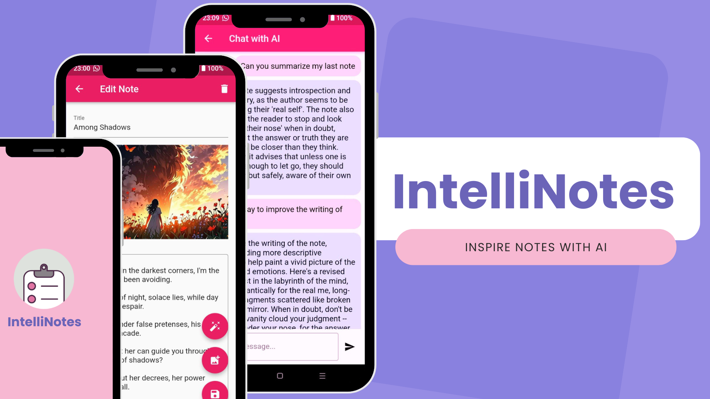

# IntelliNotes - AI-Assisted Notes Application



## Description

**IntelliNotes** is a Flutter-based notes application that integrates AI assistance to help users manage their notes efficiently. The app allows users to write, view, and store notes, and it also leverages AI-powered responses to summarize, analyze, and offer insightful suggestions based on the content of the notes. By interacting with an AI model (such as Hugging Face's Mistral-7B), IntelliNotes makes your note-taking experience more engaging and productive by providing personalized assistance based on the notes you've written.

## Features

- **Add and View Notes**: Create, read, and store your daily notes.
- **AI-Powered Assistance**: Ask the AI to summarize, organize, or analyze your notes, or simply get a question to inspire your next note entry.
- **Chat Interface**: Interact with an AI chatbot that responds to your queries based on the notes you’ve saved.
- **Dark/Light Mode**: The app dynamically adjusts to the system's dark or light mode.
- **Note Suggestions**: Get interesting questions and ideas based on your notes, making it easier to continue writing.

## Purpose

The purpose of **IntelliNotes** is to bring intelligence into note-taking. While traditional note-taking apps only let you create and store notes, IntelliNotes goes beyond by incorporating an AI assistant. Whether you're looking for inspiration, organization, or analysis of your notes, IntelliNotes helps you stay engaged and organized in a more meaningful way.

## Tech Stack

- **Flutter**: Framework for building the cross-platform mobile application.
- **Hugging Face API**: Used for AI responses and interaction based on note content (Mistral-7B model).
- **SQLite (sqflite_ffi)**: For local storage of notes in a database.
- **Material Design**: UI components used to create a visually pleasing and functional interface.

## Screenshots

To be displayed

## How to Run Locally

### Prerequisites

Before running the app locally, ensure you have the following installed:

1. **Flutter SDK**: You can download and install Flutter from the official site: [https://flutter.dev/docs/get-started/install](https://flutter.dev/docs/get-started/install).
   
2. **Android Studio** or **VS Code**: These are recommended IDEs for Flutter development. Both come with the necessary tools for Android and iOS development.

3. **Database Dependencies**: The app uses SQLite for local storage, so ensure the `sqflite_ffi` package is installed correctly.

4. **Hugging Face API Token**: You’ll need to get an API token for the Hugging Face API to enable AI responses. You can register for an account and obtain the token here: [https://huggingface.co/](https://huggingface.co/).

### Steps to Run

1. Clone the repository:

    ```bash
    git clone https://github.com/your-repo/intelliNotes.git
    ```

2. Navigate to the project directory:

    ```bash
    cd intelliNotes
    ```

3. Install the dependencies:

    ```bash
    flutter pub get
    ```

4. Set up your **Hugging Face API token** in the code (replace the placeholder in the `ChatScreen` widget):

    ```dart
    final String _apiToken = 'YOUR_HUGGING_FACE_API_TOKEN';
    ```

5. Run the app on an emulator or connected device:

    ```bash
    flutter run
    ```

6. The app will automatically detect whether your system is in **Dark Mode** or **Light Mode** and adjust the UI accordingly.

## Notes Database

The app uses **SQLite** to store the notes locally. You can use the built-in database helpers in the `DatabaseHelper` class to interact with the database.

### Database Operations:

- **Add Note**: Add new notes to the database.
- **View Notes**: Retrieve all stored notes.
- **AI Assistance**: The app fetches the content of all stored notes to send to the AI model and receive intelligent responses or suggestions.

## Troubleshooting

- **API Issues**: Ensure your Hugging Face API token is valid and that your API call limit hasn’t been reached.
- **SQLite Database Issues**: Make sure the app has permission to write to the device storage, especially if you’re testing on a real device.

## Contributing

Feel free to fork the repository, open issues, and submit pull requests. All contributions are welcome!

## License

This project is licensed under the MIT License - see the [LICENSE](LICENSE) file for details.
